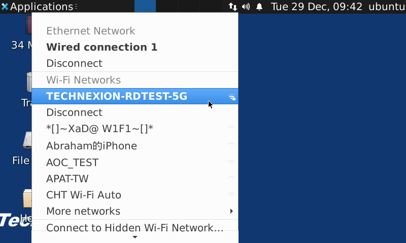
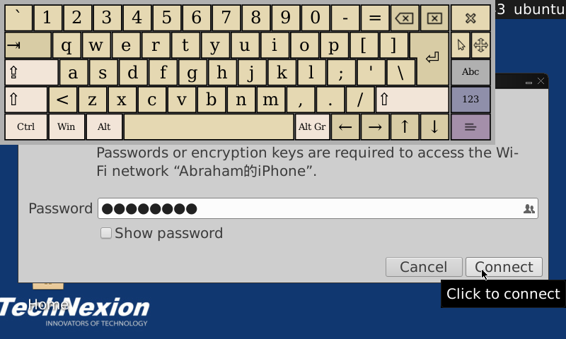
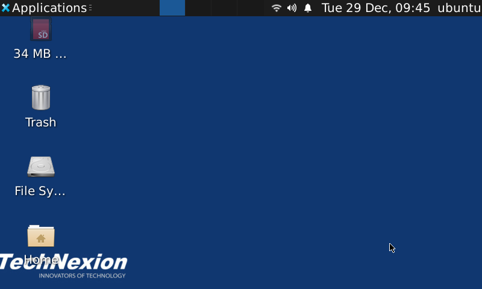
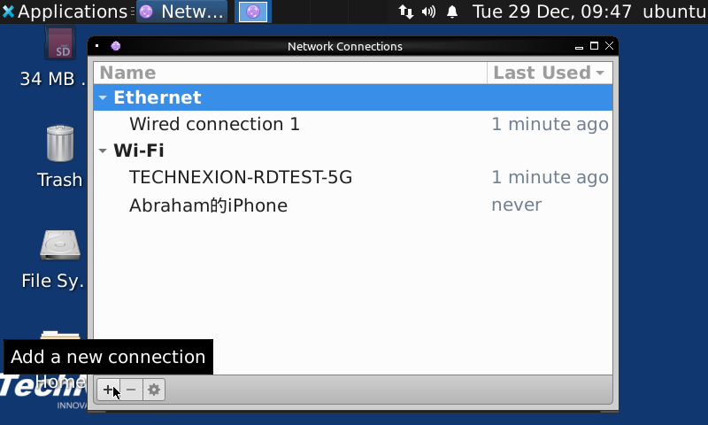
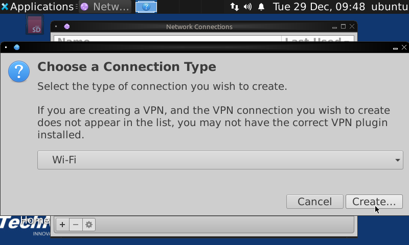
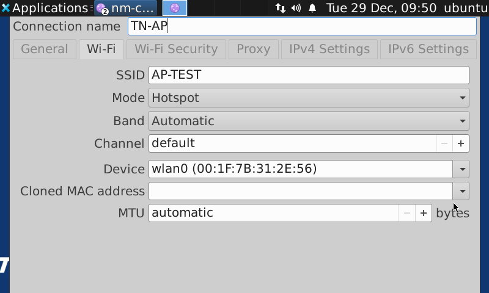

IMX6/IMX7 Platforms for Ubuntu 20.04 with X11 Framework
===========================

****
## Contents
* [Overview](#Overview)
* [Build Ubuntu Image (for developer)](#Build-Image)
    * Download the source code
    * Compiling Environment Setup
    * Build a runtime Image
    * Flash the image to the target board
* [Quick Start (for user)](#Quick-Start)
    * Run the apps using debug console/ssh
    * Playback video
    * `glmark` for GPU testing
    * Control WiFi connection
    * Control Bluetooth connection
    * 4G/5GNR mobile connection
    * Docker conatiner
    * Expand rootfs partition
    * Firefox

* [Apps Developing](#Apps-Developing)
* [Known Limitations](#Known-issues)

****
### Overview
-----------
Technexion Ubuntu rootfs(Root Filesystem) was be generated by bash scripts, that help the
users to produce a customized ubuntu image using Cananical unique tool named `debootstrap`,
then adapt QEMU to config custom packages and tools from host PC.

**Default username:password = ubuntu:ubuntu**

**Superuser username:password = root:root**

We recommended adapt ubuntu user as normal use, and adapt root user to do deveoping and debuging because Weston is running on root permission, it will not worked if you call GUI relate commands using "ubuntu user".

Features:
* LTS version until 2025/04
* XFCE4 Desktop with GPU accelelation v4.14
* X-Server v1.20.8
* gstreamer1.0 v1.16.2
* VPU libraries v6.4.3
* apt-get package manager
* openGL with GPU accelelation v6.4.3
* docker container v19.03.8
* Swap parition implementation using zram

****
### Build Ubuntu Image
-----------

#### Download the source code

Github way (Prepare git command first is recommended)

Install git first:

    $ sudo apt-get install repo

Note that repo already support ptthon 3.7+ only from 2020 ends, if your host OS is Ubuntu, please adapt Ubuntu 20.04, it can get newer repo base on python 3.7, or you need fix it manually.

Download source code:

    $ git clone https://github.com/TechNexion-customization/ubuntu-tn-imx.git

#### Compiling environment setup

General Packages Installation (Ubuntu 20.04 is recommended)

    Install necessary packages
    $ sudo apt-get install gawk wget git git-core diffstat unzip texinfo gcc-multilib build-essential \
    chrpath socat cpio python python3 python3-pip python3-pexpect \
    xz-utils debianutils iputils-ping libsdl1.2-dev xterm \
    language-pack-en coreutils texi2html file docbook-utils \
    python-pysqlite2 help2man desktop-file-utils \
    libgl1-mesa-dev libglu1-mesa-dev mercurial autoconf automake \
    groff curl lzop asciidoc u-boot-tools libreoffice-writer \
    sshpass ssh-askpass zip xz-utils kpartx vim screen bison flex \
    debootstrap qemu-system-arm qemu-user-static libssl-dev

    Install cross-compiler
    $ sudo apt-get install gcc-arm-linux-gnu

****
#### Build a runtime Image

Quick way, make a runtime image directly with parameter for target platform, default is PICO-IMX8MM without platform assigning:

    $ make all
    (it will download the latest u-boot, kernel and rootfs and compile them automatically)

    PICO-IMX6:
    make all PLATFORM="pico-imx6"

    PICO-IMX7:
    make all PLATFORM="pico-imx7d"

    PICO-IMX6ULL:
    make all PLATFORM="pico-imx6ull"

    EDM-IMX6:
    make all PLATFORM="edm-imx6"

You also can compile the source code separatically, default is PICO-IMX8MM without platform assigning:

    $ make u-boot (download and compile the latest u-boot only)
    $ make kernel (download and compile the latest kernel only)
    $ make rootfs (download and compile the latest rootfs only)
    $ make image (package runtime image only, depend on above three items done)

    Example for compile u-boot with specific platform:
    $ make u-boot PLATFORM="<target platform>" (target platform: pico-imx6, pico-imx7, etc.)

Remove all compiled objects and image:

    $ make clean

#### Flash the image to the target board

Output relative image files of path:

    $ ls output
    kernel  rootfs.tgz  u-boot  ubuntu.img

We provide two ways for image flashing:

**1. `uuu` way**

It's a modular flash tool base on serial download mode, download the tools from technexion website as following link:

Download: [prebuilt binary](ftp://ftp.technexion.net/development_resources/development_tools/installer/imx-mfg-uuu-tool_20200327.zip)

Step 1. Connect a Type-C cable between host PC and the board

Step 2. Change the boot mode from eMMC mode to serial download mode

Step 3. Issue uuu command to flash the compiled Ubuntu image to eMMC:

    $ sudo uuu/linux64/uuu -b emmc_img imx6/pico-imx6-flash.bin ubuntu.img

Step 4. Change back boot mode from serial download mode to eMMC mode, it should be works!

For Windows OS or want to know the detail users , please click this [link](https://github.com/TechNexion/u-boot-edm/wiki/Use-mfgtool-%22uuu%22-to-flash-eMMC)

**2. `ums` way**

It's a easy way base on u-boot prompt of eMMC boot mode, but the disadvantage is the speed is a little bit lower than `uuu` way, another limitation is it must be existed a works u-boot inside the eMMC, if not, you still need adapt `uuu` way at first.

Step 1. Keep eMMC boot mode

Step 2. Connect a Type-C cable between host PC and the board for image flashing

Step 3. Connect a micro-usb cable between host PC and the board for debeg cosole

Step 4. press enter key on debug console when boot up u-boot, let u-boot into prompt

Step 5. Target board side: Issue ums command to mount eMMC as a mass storage:

    # ums 0 mmc 2

Step 6. Host PC side: Adapt basic `dd` command is enough for image flashing:

    $ sudo dd if=ubuntu.img of=/dev/sdx bs=1M (sdx means the device node which ums mounted storage)
    $ sync

**QCA9377:** If you want to enable  QCA9377 WiFi/Bluetooth functions, please copy relate firmware files to specific path of rootfs partition as following:

    WiFi:
    $ sudo cp -a <firmware path>/qca9377/bdwlan30.bin mnt/lib/firmware/qca9377/
    $ sudo cp -a <firmware path>/qca9377/otp30.bin mnt/lib/firmware/qca9377/
    $ sudo cp -a <firmware path>/qca9377/qwlan30.bin mnt/lib/firmware/qca9377/
    $ sudo cp -a <firmware path>/qca9377/utf30.bin mnt/lib/firmware/qca9377/
    $ sudo cp -a <firmware path>/wlan/cfg.dat mnt/lib/firmware/wlan/cfg.dat
    $ sudo cp -a <firmware path>/wlan/qca9377/qcom_cfg.ini mnt/lib/firmware/wlan/qca9377/qcom_cfg.ini

    Bluetooth:
    $ sudo cp -a <firmware path>/qca/nvm_tlv_3.2.bin mnt/lib/firmware/qca/nvm_tlv_3.2.bin
    $ sudo cp -a <firmware path>/qca/rampatch_tlv_3.2.tlv mnt/lib/firmware/qca/rampatch_tlv_3.2.tlv

    Please contact sales@technexion.com to get firmware files.

****
###  Quick Start
-----------

#### Run the apps using debug console/ssh

    $ export DISPLAY=:0.0
    $ firefox

#### Playback video

Adapt gstreamer-1.0 which supports avi, mp4, mkv and webm format files, please change to root user and issue quick command to play video:

    $ gplay-1.0 /home/ubuntu/mnt/test.mp4

    Specific audio card output
    $ gplay-1.0 /home/ubuntu/mnt/test.mp4 --audio-sink="alsasink device=plughw:0"

#### `glmark` for GPU benchmark testing

    $ export DISPLAY=:0.0
    $ glmark2-es2

#### Control WiFi connection

Ubuntu adapt network-manager GUI to manage network status, so please folow steps to create wifi connection:

##### Station mode

Clicking the network manager icon of right top side.
Note that please select the hotspot under "Wi-Fi Networks (wlan0)", NOT "Wi-Fi Networks (p2p0)", or you will got a connection failed message.

Then enter the password for your target hotspot, note that the "Wi-Fi adapter" need choose wlan0, it works after click "Connect" button.
You can use virtual keyboard "onboard" to keyin password if you have no keyboard as follows picture.

Start enjoy your WiFi network.

##### AP mode

Please choose the "Edit Connections" item first.

Coose plus button for "add new connection".

Choose the "Wi-Fi" as your connection type.

Setting the relative configuration as following picture, remember to set "Hostpot" as default mode.

Setting the WPA password(recommended), then save the configuration and exit, and reboot the Ubuntu.

Note that some resolution of screen may not show the save item(too small), please click the WPA password text once, and plug-in a USB keyboard, then press "TAB" key two times and press "Enter" key to save it directly.

After reboot, the hotspot already works! the user can connect it via smart phone, notebook or other devices.

#### Control Bluetooth connection

Step 1. Initial Bluetooth function (root permission)

      PICO-IMX6
      hciattach -t 30 /dev/ttymxc1 any 115200 flow &
      EDM-IMX6
      hciattach -t 30 /dev/ttymxc2 any 115200 flow &
      PICO-IMX6UL
      hciattach -t 30 /dev/ttymxc4 any 115200 flow &
      PICO-IMX7
      hciattach -t 30 /dev/ttymxc6 any 115200 flow &

      hciconfig hci0 up

Then you'll see a icon at the right-top side of desktop, you can click it and choose relate functions what you want as follows picture.

#### 4G/5GNR mobile connection

Network-manager GUI at the right-top side of deskop can help users setting mobile connection easily, remember got right APN name first.

* Tested modules
    * mPCIE
        * FIBOCOM NL668-EU (4G)
    * M.2
        * SIMCOM SIM8202G-M2 (5GNR)
        * TELIT LN930 (4G)
        * SIERRA EM7430 (4G)

#### Docker conatiner

For OS virtualization requirement, we enable docker engine in Ubuntu, the users can use docker commands to pull exist containers from dockerhub, of course it can build in Ubuntu using dockerfile, note that you have to choose aarch64 strcuture base container.

#### Expand rootfs partition

After flash the ubuntu image to eMMC, you'll see a pop-up window at first boot as following figure:

The system will starting expand rootfs partition and wait for about 10 seconds, it will auto reboot and you can start enjoy your Ubuntu. 

#### Camera capture

Note that XFCE desktop has GPU acceleretions using IMX6, so please use gstreamer to running camera overview mode as follows:
  
    gst-launch-1.0 imxv4l2src device=/dev/video1 ! imxv4l2sink

IMX6ULL/IMX7 has no GPU, so users can use other common camera apps such as 'guvcview' utilities.

#### Firefox

|#|method|command|
|---|---|----
|1| click icon| icon is exist on desktop
|2| basic browser| # firefox
|3| kiosk mode (full screen)| # firefox --kiosk www.technexion.com

****
###  Apps Developing
-----------

**Toolchain**

**1. Non-GUI/Web GUI applications**

Example: IoT, Industrial or Machine Learning

|#|Language|libraries|
|---|---|----
|1|JAVA|apt-get install openjdk11-jdk
|2|Python|apt-get install python3-pip
|2|JavaScript|apt-get install nodejs npm
|2|Golang|apt-get install golang
|2|C/C++|apt-get install gcc

The users also can compile the program on host PC side using cross-compiler if adapt non-OO programming language.

**2. GUI applications with HW acceleration**

Example: OpenGL

|#|Language|libraries|
|---|---|----
|2|C|OpenGL

We recommended developing GUI applications on host PC side, it's saving eMMC usage for develop libraries especially huge HMI system, so Technexion will provide a Graphic SDK for host PC side use soon.

****
### Known Limitations
-----------

1. Low speed bluetooth, improve the performance later.

